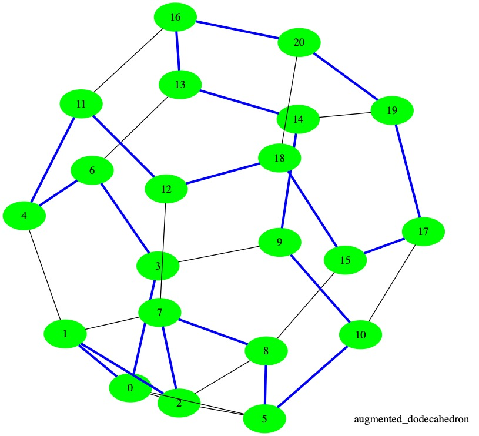

# Projet scolaire: les cycles Hamiltoniens sur les polyèdres.
- Anis HEZAM

- Nécéssite l'installation de Graphviz.

- Exemple d'utilisation :  ```python3 main.py augmented_dodecahedron```

Quelques polyèdres sont disponibles dans ```./polys```.



